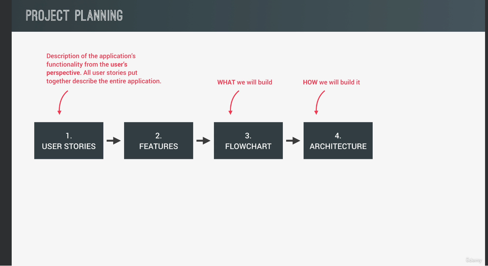

# How to plan a project

In a real-world project, it is really important to start with the project
planning process before jumping ahead start coding. There are different
ways of planning a project, below are the process that will work for
small and medium size projects

## Step 1: Create User Stories

A user story is basically the description of the application from the user's
perspective. When all the user stories are put together we clearly describe
the functionality of the entire application

### How to write user stories

Common format: As a [type of user], I want [an action] so that [a benefit]

Examples:

1. As an user, I want to log my running workouts with location, distance, time, pace and steps per minute, so I can keep a log of all my running

2. As a user, I want to log my cycling workouts with location, distance, time, speed and elevation gain, so I can keep a log of my cycling

3. As a user, I want to see all my workouts at a glance, so I can easily track my progress over time

4. As a user, I want to also see my workouts on a map, so I can easily check where I workout the most

5. As a user, I want to see all my workouts when I leave the app and come back later, so that I can keep using the app over time

## Step 2: Features

Once all user stories are defined, they help us as developer deciding the features to build intended.

### How to define features based on user stories?

Creating user stories gives us an idea of features that needs to build to complete the application

Based on the user stories here are some examples of the features:

#### Features of user story 1

1. Map where user clicks to add a new workout (best way to get location co-ordinates)

2. Geolocation to display map at current location (more user friendly)

3. Form to input distance, time, pace, cadence

#### Features of user story 2

1. Form to input distance, time, speed, elevation gain

#### Features of user story 3

1. Display all workouts in a list

#### Features of user story 4

1. Display all workouts on a map

#### Features of user story 5

1. Save the data of the user in the browser in the local storage

2. Display saved data in the map and in the list

## Step 3: Flowchart

Based on the decided features, we will create flowcharts that clearly outlines the data flow, conditions and more

## Step 4: Finalizing Architecture

In this context, architecture means what JS features will use to develop the decided features.

It then gives us the structure in which we can build our functionalities
